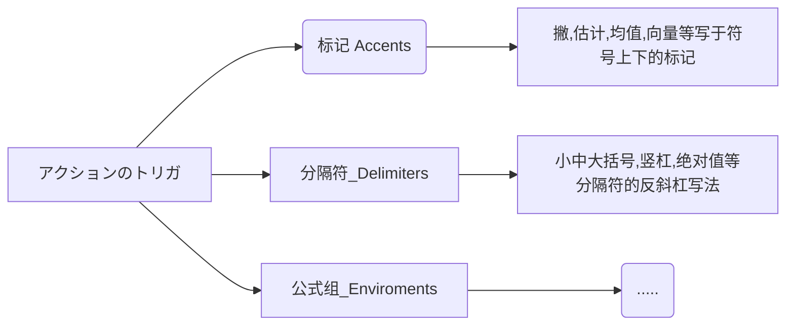

[ER图](https://blog.csdn.net/horsee/article/details/114022853)

https://mermaid-js.github.io/mermaid/

[思维导图](https://blog.csdn.net/qq_43605381/article/details/106085929)

https://markmap.js.org/repl/

