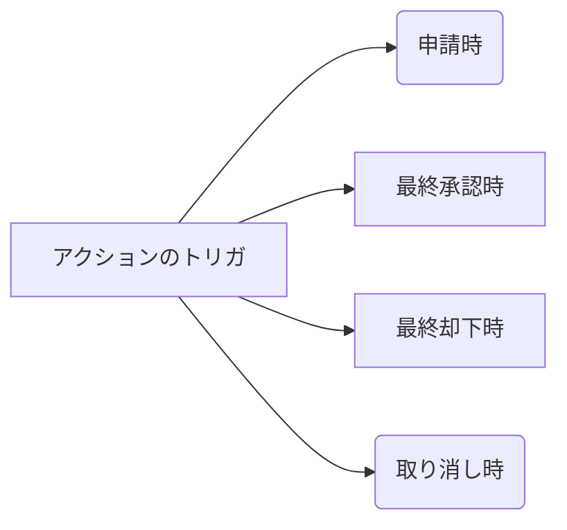

### 承認プロセス

アクションのトリガは下記4種類

- 申請時
- 最終承認時
- 最終却下時
- 取り消し時

承認申請の履歴を確認するには承認履歴関連リストから確認する。
条件を満たしたら承認申請を出すのであればプロセスビルダーを使用する。

##### Actions

- Email Alert
- Field Update
- OutBound Message

##### approvers

- permissions
  - “Modify All Data”
  - “Modify All” for an object

- Make sure that the assigned approver has access to read the records for the approval requests. For example, a user who can’t view expense records can’t view expense approval requests.
- Approval processes that let users select an approver manually also let users select themselves as the approver

