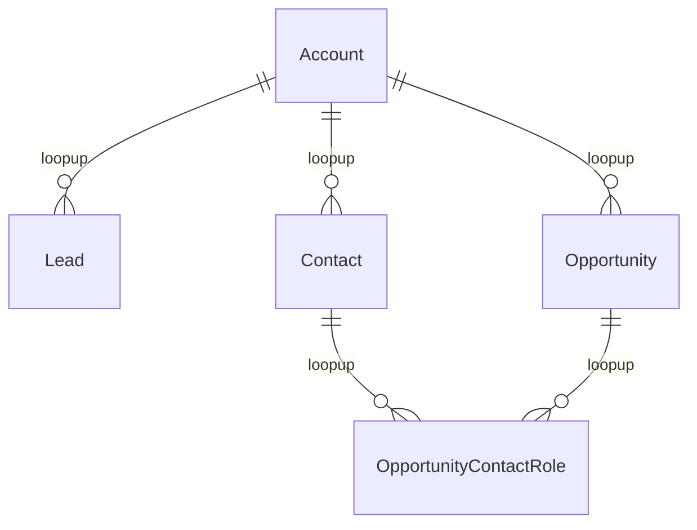
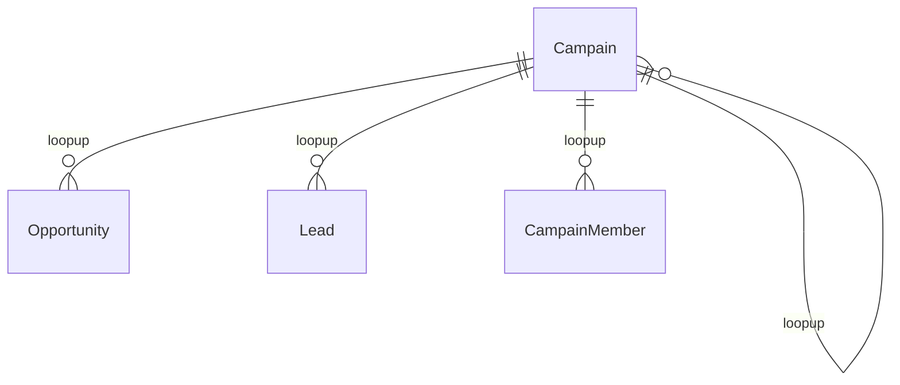
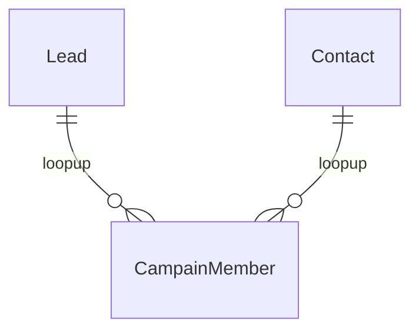
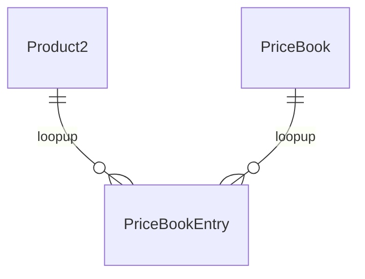

# Administrator1知识点

### 标准SObject

- 表

  - 不可删除
  - 权限可设定
  - Label名字可修改 （Setup  => Rename Tabs and Labels）

- 字段

  - 不可删除
  - 权限可设定
  - Label名字可修改 （タブと表示ラベルの名称変更から変更）
  - 可设定Help text
  - 可设定下拉列表值

  ---

### Roll-Up Summary

[文档](https://help.salesforce.com/s/articleView?id=sf.fields_about_roll_up_summary_fields.htm&type=5)

- COUNT
- SUM
- MIN
- MAX

特点有很多

- Any custom object that is on the master side of a master-detail relationship

- Any standard object that is on the master side of a master-detail relationship with a custom object

- Opportunities using the values of opportunity products related to the opportunity

  - Quote ⇒ Opportunity 
  - OpportunityLineItem ⇒ Opportunity 

- Accounts using the values of related opportunities

  - Opportunity  ⇒ Account

- Campaigns using campaign member status or the values of campaign member custom fields

  - CampaignMember   ⇒ Campaign

- 如果您的组织使用多种货币，则主记录的货币决定汇总汇总字段的货币。例如，如果主记录和明细记录的币种不同，则明细记录值转换为主记录的币种。

- 避免从子记录中引用汇总汇总字段。从子记录引用的汇总汇总字段可能具有过时的值，因为它们的父记录尚未更新。相反，从父记录引用汇总汇总字段。您的汇总汇总字段将始终具有更新的值，因为该规则在父值更新后运行。

  如果您尝试在父汇总汇总字段上强制执行 25 条记录限制，请在您的子对象上创建验证规则。添加子记录时，子对象上的验证规则可以检查计数是否已经为 25 或更多。

---

### 删除自定义字段时

- 删除自定义字段时，将删除所有的字段历史数据并且不再跟踪更改。
- 删除后该字段及值可复活(在 15 天之后自动将其永久删除)
- workflow，rule，apex中被使用的话，则无法删除
- page layout中的自动被删除，无需手动删除
- 如果后台作业正在更新字段，比如，更新累计汇总字段，则您不能删除此字段。等待直到后台作业完成更新，然后重试。
- 一个后台进程定期运行，清理与已删除的自定义字段相关的元数据。此过程会影响页面布局、记录类型和自定义对象上的上次修改日期和上次修改人字段。

---

### Record type

RecordType可为不同的用户提供

- 不同的业务流程 (画面上可选择哪个)
- 不同的选项列表值
- 不同的页面布局 (不同RecordType可看到不同page layout, 不同Profile也可看到不同page layout)
- 商談、ケース、リード、ソリューションの場合、ビジネスプロセスの設定が必要

---

### 数式字段

- 根据数式自动设值，只能参照，不可编辑
- 最大 3,900 文字
- 在评估公式表达式后显示的字符最大数目为 1,300 个
- 无法删除在公式中引用的字段。删除前，请将字段从公式中移除
- 字段的值不能取决于引用它的其他公式	

---

### cross-object

---

### Leads

**Convert 之后会自动生成**

正常

- Account
- Contact
- Opportunity

启动個人取引先的情况下

- 個人取引先
- 商談

**Convert所需要的Profile权限**

- 「リードの取引の開始」プロファイル権限
- リード、取引先、取引先責任者、商談への「作成」「編集」アクセス

**当Lead表中创建了自定义字段，Convert时也想对应的过去（Account，Contact，Opportunity）**

- Map Lead Fields（Lead => Fields & Relationships => Map Lead Fields）

  

**Lead Assignment Rules** (QueueSetup => Lead Assignment Rules )

将Lead自动分配给

- User

- Queue

  - Users

  - Public Groups

  - Roles

  - Roles and Internal Subordinates (角色和内部下属)

  - Roles, Internal and Portal Subordinates(角色、内部和门户下属)

**Web-to-Lead**

指定网页表单 用户输入后可自动生成lead

---

### Campain

Marketing User选中之后

- 可操作(curd)Campain
- 即使有操作权限，但是不选中Marketing User的话，也无法编辑Campain

Campain的层级

- Campain表中有个Parent字段指向自身。
- 让Campain与Campain父子相连接，使其可结构化

Lead Convert后

- 转换一个链接到Campain的Lead时，该Campain自动插入Opportunity的Campain字段。
- 对于和多个市场活动相关联的潜在客户，Salesforce 会将最新关联的市场活动添加至业务机会
- 如果Lead或Contact被链接到多个Campain，最近与其关联的Campain将被插入到Opportunity的Campain字段。

キャンペーンレコードにメンバーの管理ボタン

- キャンペーンに既存の取引先責任者を関連づける。
- 新しいリードをインポートして、キャンペーンに関連付ける。

---

##### 取引先(商談、ケース)チーム

個々のレコード単位で設定されたチームメンバーに対してアクセス権の付与ができる。
チームメンバーをあらかじめ設定しておくことで簡単に共有をすることができる。

---

### Workflow

特定の条件が満たされた時にアクションが実行される。指定のアクションは下記の4種類。

- Todo
- メールアラート
- 項目自動更新
- アウトバウンドメッセージ

評価条件は下記の3種類、それぞれ『レコードが』が主語

- 作成された時
- 作成された時、および編集されるたび
- 作成された時、およびその基準を満たすように編集された時

ルール条件は下記の2種類

- 条件が一致する
- 数式の評価がTureになる時

##### 項目自動更新

条件に合致したレコードの項目を変更する。→レコードタイプの変更も可能なので、商談が成立したものは営業は参照のみのレコードタイプに変更するなどの設定も可能。

##### アウトバウンドメッセージ

レコードの情報をエンドポイントへのAPIメッセージの形で送信することができる。

##### 時間ベースのワークフロー

- タイムトリガ。ルールが適用されたタイミングから○日前、○日後、○時間前、○時間後の設定ができる。
- 実行されるまでのアクションはキューに待機される、Setup→Monitoring→Time-Based Workflowで検索可能
- キューの待機中に条件に適合しなくなった場合はアクションが削除される。
- 删除时间Action时并不会删除已经准备启动的动作
- ワークフロールールの基準が「レコードが作成または編集されたとき」に設定されている場合、時間ベースのワークフローアクションを使用できない

---

### エスカレーションルール

ケースが登録されてから一定の時間が経過した場合に

- 所有者を変更したり、
- メールで通知ができる。

実行は15分ごとに行われる。エスカレーションの設定時間は30分、時間単位である。

割り当て、エスカレーションルールによって発生した変更のためのケースの履歴関連リストに記載されるユーザは
サポート設定で指定された自動化されたケースの利用者になる。

---

### インポートウィザード

- accounts
- contacts
- leads
- campaign members
- person accounts
- solutions
- custom objects

注意点：

- 取引先と取引先責任者(1回の動作で2オブジェクトにレコードをインポートできる。データローダではできない。)
- 取り込みできないオブジェクト
  - 商談
  - ケース
- 重複回避のための一致項目の使用が可能。通常セールスフォースID、外部IDだが、メールアドレスなども使用可能。
- ワークフローの適用有無も選択できる。(データローダは標準で適用される。)

---

### ウィークリーデータエクスポート

週に一度もしくは**月に一度**(ウィークリーだけではない)のタイミングを設定でき、添付ファイルなども含めたエクスポートが可能。
データローダでもエクスポートはできるが、定期実行を設定できるのはこの機能。

---

### 入力規則のタイミング

入力規則はあくまでもレコードが保存される時に始まる。
下記の順番で実行されるため覚えておく。

1. 入力規則
2. 割り当てルール
3. 自動レスポンスルール
4. ワークフロールール
5. プロセスビルダー
6. エスカレーションルール

順番が後になった際の更新(ワークフロールールの項目自動更新など)では入力規則はみられないため回避ができる。

---

### ユーザの作成について

- 単一のユーザ作成、もしくは複数のユーザの一括登録が可能。

- ユーザレコードは削除はできないため、無効化して論理削除する必要がある。
  - 凍結→ライセンスは消費するがユーザはログインできなくなる
  - 無効化→ライセンスの消費もされずユーザはログインできなくなる

- システム管理者はユーザとして代理ログインすることが可能(代理管理者に設定されているユーザも可能)
- パスワードリセットは複数ユーザに一括で送信することができます。

---

### 選択リストを連動させる

制御項目：東京都

連動項目：北区、渋谷区など

制御項目一つに対したくさんの連動項目を持つことができる

---

### 類似商談

Available in: Salesforce Classic

Available in: **All** Editions in orgs activated before Summer ’09

仲間がうまく同じ競争相手と競争、同等の製品と他の商談を管理しているかを理解する

---

### 代理管理者は次の操作を実行できます

- 指定されたロールとそのすべての下位ロールのユーザを作成および編集する。(ユーザ編集作業には、パスワードのリセット、目標の設定、デフォルトの商談チームの作成、そのユーザの非公開グループの作成などが含まれます)。
- ユーザをロック解除する。
- 指定したプロファイルにユーザを割り当てる。
- 代理グループのユーザの権限セットを割り当てる、または削除する。
- 公開グループを作成し、指定した公開グループのメンバーシップを管理する。
- システム管理者にログインアクセスを許可したユーザとしてログインする。
- カスタムオブジェクトを管理し、カスタムオブジェクトのほぼすべての面をカスタマイズする。ただし、代理管理者がオブジェクトのリレーションを作成または変更することや、組織の共有設定を行うことはできません。
- 代理管理者に割り当てられているすべての代理グループのユーザを管理する。たとえば、Sam Smith が、グループ A とグループ B という 2 つの代理グループの代理管理者に指定されているとします。Sam は、グループ A の権限セットまたは公開グループをグループ B のユーザに割り当てることができます

不可：

- 全てのユーザのパスワードをリセットする
- 新しいユーザプロファイルを作成する

---

### コミュニティエキスパートの指定

专家是意见社区的一个成员，代表贵组织发表可信和权威的论断。在专家发布评论或意见时，其名称 () 旁边会显示一个独特图标。Salesforce 管理员可根据需要指定任意数量的专家。

- 专家可以是贵组织负责为意见社区提供官方响应的员工。专家也可以是在意见社区中启用并且了解主题的贵组织之外的某个人。
- 专家和其他意见社区成员之间的唯一区别是显示在专家姓名旁边的唯一图标。专家不具有超过其用户简档和权限集指定的任何额外权限。
- 专家必须是公用小组的一部分，并且该公用小组必须在专家小组下拉列表中指定。如果每个意见社区中的专家不同，请考虑为每个社区创建公共组。
- 如果意见社区显示在客户入口网站或合作伙伴入口网站中，则可以使用级联样式表 (CSS) 更改与专家关联的图标。在创建新入口网站时，在您的入口网站标题中指定级联样式表 (CSS)，然后使用 `expertUserBadge` 类引用专家的新背景图像。图标的像素不超过 16 乘 16。

- コミュニティエキスパートは、アイコンによって指定されることができる。
- コミュニティエキスパートは、Salesforceアイデアのために指定することができる。

---

### Transfer Records

[参考](https://help.salesforce.com/s/articleView?id=sf.data_about_transfer.htm&type=5)

| USER PERMISSIONS NEEDED                                      |                                                              |
| :----------------------------------------------------------- | ------------------------------------------------------------ |
| To transfer multiple accounts, campaigns, contacts, contracts, and custom objects: | Transfer RecordANDEdit on the object type                    |
| To transfer multiple leads:                                  | Transfer Leads OR Transfer RecordANDEdit on leads            |
| To transfer multiple cases:                                  | Transfer Cases OR Transfer RecordANDEdit on casesANDRead and Transfer Record on related accounts |
| To transfer account, asset, case, contact, lead, note, opportunity, order, PersonAccount, ServiceContract, SalesTeam, or any custom object to an inactive user: | Update Records with Inactive Owners (API only)ANDEdit on the object type |
| To transfer account, asset, case, contact, lead, note, opportunity, order, PersonAccount, ServiceContract, SalesTeam, or any custom object from an inactive user: | Update Records with Inactive OwnersANDTransfer Leads OR Transfer Cases OR Transfer Leads OR Transfer Record (Classic only)ANDEdit on the object type |

| METHOD                                                       | AVAILABLE FOR                                                |
| :----------------------------------------------------------- | :----------------------------------------------------------- |
| Transfer a single record                                     | Accounts, campaigns, cases, contacts, contracts, leads, opportunities, and custom objects |
| Transfer multiple records by selecting the records from a list view and clicking **Change Owner** | Cases, leads, and custom objects, which can belong to either a user or a queue |
| Transfer multiple records using the Mass Transfer tool       | Accounts, leads, and custom objects                          |

##### Mass Transfer Records

Setup => Mass Transfer Records

[参照](https://help.salesforce.com/s/articleView?id=sf.admin_transfer.htm&type=5)

| Account 可转移                                               |
| ------------------------------------------------------------ |
| Transfer open opportunities not owned by the existing account owner |
| Transfer closed opportunities                                |
| Transfer open cases owned by the existing account owner      |
| Transfer closed cases                                        |
| Keep Opportunity Team on opportunities transferred to new owner. |

---

### 外部ＩＤ

使用できる項目タイプ

- テキスト項目
- 数値項目
- メールアドレス項目

---

### 標準システム管理者プロファイル

能：

- パスワードポリシー
- カスタムプロファイルを定義し、ユーザに割り当てる
- ユーザに機能ライセンスを割り当てる
- カスタムアプリケーション設定
- タブ設定
- デスクトップインテグレーションクライアントオプション
- セッションの設定
- 管理者は「マーケティングユーザ」ライセンスも持っていないとキャンペーンを管理することはできません。
- 価格表と商品を管理できます

不能：

- ユーザが参照したレコードのログへアクセス
- ユーザレコードの削除
- 標準プロファイルを更新し、そのカスタムオブジェクトへの権限を付与する

---

### 条件ベースの共有ルールはどのオブジェクトに作ることができるか

能的：

- 取引先
- リード
- 取引先責任者
- ...

不能的：

- 商品
- キャンペーンメンバー

---

### Support Settings

Automated Case User

- The user listed in the Case History related list for automated case changes from:
  • Assignment rules
  • Escalation rules
  • On-Demand Email-to-Case
  • Cases logged in the Self-Service portal

---

### Task Actions

Create a task to associate with one or more workflow rules, approval processes, or entitlement processes. When changing a task, any modifications will apply to all rules, approvals, or entitlement processes associated with it.

- Select an assignee for your task. An assignee can be in the form of a user, role, record owner, record creator, opportunity team role, or account team role, depending on the type of record you chose.
- Create a task to associate with one or more workflow rules, approval processes, or entitlement processes.
- 任何人都可以将任务重新分配给同事。角色层次结构中的经理可以查看他们在角色层次结构中分配给其下方人员的任务。他们还可以使用报告在角色层次结构中查看其下方人员的任务，但不能编辑这些任务
- 在Salesforce Classic中，我们可以在有人创建或分配任务时发送电子邮件通知，具体取决于您所在组织的设置
- 在Lightning体验中，没有在分配任务时发送电子邮件或在接收任务时接收电子邮件的选项。但是，根据组织的设置，会有delegated task的电子邮件通知。

---

### Lead Assignment Rules

- Order

  for example, 1, 2, 3. 分配顺序，匹配到了为止

  若最后仍有未匹配到的数据，the item is reassigned to either the default Web-to-Lead owner, the administrator doing a lead import, or the default case owner.

---

### Conditional Formatting

Conditional formatting can be applied to summary formula columns (subtotals and grand totals).

- 集計された合計
- 集計数式
- 総合計

Record Type可用

- サマリレポート
- マトリックスレポート

---

### Product Schedules Settings

使用产品计划表确定付款或随时间交付的产品的付款和交付周期。为了灵活地管理和报告产品计划，可启用可自定义的计划。

Schedule Types

- quantity（数量，いつ商品が納入されるかが決まります。）
- revenue（収益，いつ商品の支払いが行われるかが決まります）
- デフォルトのスケジュール（特定の価格表の特定の商品に関連付けられます。）

---

### Choose a Report Type

determines which records and fields appear in your report.

---

### ユーザのパスワードの管理（システム管理者）

[参照](https://help.salesforce.com/s/articleView?id=sf.admin_password.htm&type=5)

能：

- 管理者は全てのユーザに対し一度でパスワードをリセットできる。
- 管理者はユーザに「パスワード無期限」権限を付与できる。
- 管理者はロックアウトされたユーザに送るメッセージをカスタマイズできる

不能：

- 管理者はユーザのセットにパスワードを割り当てることができる
- 管理者は、すべて数字のパスワードポリシーを強制することができる。

---

### Enable Multilingual Solutions (マルチ言語)

Available in: Salesforce Classic

Setup =>Solution Settings

- Self-Service portal
- Public solutions page

---

### Data Export

特点

- 立即导出 & 计划导出

- 为导出文件选择所需的编码

- 选择包含图像、文档和附件以及包含 Salesforce Files 和 Salesforce CRM Content 文档版本可在您的导出数据中包含这些项目。

- 如果您想要在导出文件中使用空格，而不是回车符或换行符，请选择使用空格替换回车符。如果您打算使用导出文件来进行导入或其他集成，此选择会非常有用。

- 在已导出的数据中，选择导出中要包括的数据类型。如果您不熟悉适用于一些数据类型的术语，我们建议您选择

  包含所有数据

  。请注意以下事项：

  - 公式（派生）和累计汇总字段始终不会包括在导出中。
  - 如果您的组织使用分部，导出文件中将包括来自所有分部的数据。
  - 如果您的组织使用个人客户，导出客户时，所有的客户字段都将包括在客户数据中。
  - 如果您的组织使用个人客户，那么，当您导出联系人时，个人客户记录将包括在联系人数据中。但是，联系人数据仅包括由联系人和个人客户共享的字段。
  - 包含**所有数据**选项选择所有对象，以在选中复选框时导出。对于重复计划的导出，请确保重复选择**包含所有数据**选项，以包含新创建的对象。

- 单击**开始导出**或**保存**。

  Salesforce 会创建一个 CSV 文件的 zip 归档，并在完成时通过电子邮件发给计划导出文件的用户。此通知的电子邮件地址无法更改。导出会尽快完成，但是，我们不能保证完成的日期和时间。大型导出将会分解为多个文件。要下载 zip 文件，请按照电子邮件中的链接或单击**数据导出**。Zip 文件会在电子邮件发出 48 后删除（不含周末）。例如，电子邮件在周五发出，.Zip 文件会在周二删除。

- 沙箱不支持

- 不能加筛选条件

---

### Role

- 简化用户管
- 最大数量Spring 21之后5000 个Role, Spring ’21 之前500个
- 必须将每个用户分配至某一角色，否则该用户的数据将不会在业务机会报告、预测累计和其他基于角色的显示屏中显示。
- 将所有需要查看整个组织的用户放在层次结构的最高级别。
- 不要在贵公司里为每个职位设立单独的角色。而是定义角色的层次结构，以控制低级别角色中的用户输入的信息的访问权限。
- 只为您当前的需求创建角色。不要在对未来需求的预期中创建临时占位符角色。
- 不要用报表要求来决定您需要什么层次。
- 在您更改用户角色时，将应用新角色的共享规则。
- Salesforce Knowledge 用户可以在角色详细信息页面上修改类别可见性设置。
- 在未向客户所有人分配角色时，如果联系人的组织范围内默认设置为不由父级控制，则相关联系人的共享访问权限为“读/写”。对相关业务机会和个案的共享访问权限是“无访问权限”。
- 如果您的组织使用“区域管理”，则预测以区域层次结构为基础，而非角色层次结构。
- 为了防止中断，请避免在工作时间更改角色层次结构。

性能

- 为了避免性能问题，我们建议任何一个用户都不要拥有超过 10000 条对象记录。对于必须拥有超过该数量的对象的用户，不要为他们分配角色或将他们放在层次结构顶部的单独角色中。将该用户排除在公共小组之外也很重要，公共小组可能被用作共享规则的来源。
- 为了提高性能，请尽量减少角色层次结构中的级别数。删除不需要的角色，并删除通过角色层次结构授予对已共享记录的访问权限的共享规则。

---

### 标准表

是：

- レポート
- ダッシュボード

不是

- サポート
- マーケティング
- サービスアドレス

---

### 文件夹

report or dashboard folders

Classic email template folders

Lightning email template folders

library folders

document folders （Classic）

---

### Field History Tracking

Field history data is retained for up to 18 months through your org, and up to 24 months via the API. Field history tracking data doesn’t count against your Salesforce org’s data storage limits.

Salesforce stores an object’s tracked field history in an associated object called *StandardObjectName*History or *CustomObjectName*__History

can track the field history of custom objects and the following standard objects.

- Accounts
- Articles
- Assets
- Campaigns
- Cases
- Contacts
- Contracts
- Contract Line Items
- Crisis
- Employees
- Employee Crisis Assessments
- Entitlements
- Individuals
- Internal Organization Units
- Knowledge
- Leads
- Opportunities
- Orders
- Order Products
- Products
- Price Book Entries
- Service Appointments
- Service Contracts
- Solutions
- Work Orders
- Work Order Line Items

---

### 会计年度

启用自定义会计年度的注意事项

- 在启用自定义会计年度之后，不能禁用功能。但要还原标准会计年度，您可将遵循相同公历结构的自定义会计年度定义为 Salesforce 标准会计年度。
- 会计年度定义不会自动创建。为进行的业务定义每年自定义会计年度。
- 启用和定义自定义会计年度会对预测、报表和定额产生影响。
  - 在您定义第一个自定义会计年度时，将删除当年第一个期间中的所有现有预测、预测历史和预测调整。对于第一个自定义会计年度之前的期间，系统将不会删除其预测，您可以按照通常的方式访问这些预测。
  - 在您定义新自定义会计年度时，任何现有预测、预测历史、预测调整和对应标准会计年度的配额会丢失。
- 您无法在业务机会、包含该产品的业务机会或者包含计划报表的业务机会中使用会计期间列。
- 业务机会列表视图不包括会计期间列。
- 当启用自定义会计年度时，您不能在 SOQL 中使用 `FISCAL_MONTH()`、`FISCAL_QUARTER()` 或 `FISCAL_YEAR()` 日期函数。

---

### 对象关系概览

- 主従関係
- 多対多
- 参照関係
- 外部参照
- 間接参照
- 階層

---

### Salesforceデータをバックアップ

- Data Export (Monthly Export Service)
- Dataloader
- Report Export

---

### Knowledge

正确：

- Users can rate the helpfulness of articles.
- Knowledge articles are always publicly available for customers.

错误：

- Any user can write and publish articles
- Knowledge articles integrate with Service Console.

---

### Themes and Branding

正确：

- Up to 300 custom Themes can be created per org

- Only one Theme can be applied in an org at a time.

- **Salesforce Mobile app   company's bran-specific images**

  Loading Page Color, Action Colors, Loading page Logo

  

  theme

  Only one theme can be active at a time, and a theme applies to the entire org.

  Up to 150 custom themes can be created, modified, or cloned from the built-in themes.

  ---

  

错误：

- Each profile can be applied a different Theme
- Themes apply to both Lightning Experience and mobile.

---

### Campaign Influence

允许营销人员对影响单个机会的多个营销活动进行测量和报告。有影响力的活动可以手动或自动与Opportunity关联。

可让用户在业务机会上查看影响市场活动
将多个有影响力的活动纳入到单一的业务机会。

---

### Salesforce コミュニティ機能

この機能は社外の人たち、たとえば顧客やパートナーに自社の Salesforce のID・PWを共有することで、Salesforce上で情報を共有することができます。

コミュニティの使用例（オンラインヘルプから）

- 従業員と流通業者、再販業者、納入業者を接続し、販売を促進する
- 顧客から回答を得られる一元的な場所を用意することにより、世界クラスのサービスを提供する
- ソーシャルな聴取、内容、取り組み、およびワークフローのすべてを一元管理する

Customer Community

​	外部客户case用

Customer Community Plus

​	外部客户reports and dashboards用

Partner Community

​	外部客户sales data用

---

### Salesforce Mobile 不可用功能

- **[Data Access and Views: What’s Different or Not Available in the Salesforce Mobile App](https://help.salesforce.com/s/articleView?id=limits_mobile_sf1_data.htm&type=5&language=en_US)**
- **[Sales Features: What’s Different or Not Available in the Salesforce Mobile App](https://help.salesforce.com/s/articleView?id=limits_mobile_sf1_sales.htm&type=5&language=en_US)**
- **[Productivity Features: What’s Different or Not Available in the Salesforce Mobile App](https://help.salesforce.com/s/articleView?id=limits_mobile_sf1_productivity.htm&type=5&language=en_US)**
- **[Data Quality and Enhancement: What’s Different or Not Available in the Salesforce Mobile App](https://help.salesforce.com/s/articleView?id=limits_mobile_sf1_data_quality_and_enhancement.htm&type=5&language=en_US)**
- **[Customer Service Features: What’s Different or Not Available in the Salesforce Mobile App](https://help.salesforce.com/s/articleView?id=limits_mobile_sf1_service.htm&type=5&language=en_US)**
- **[Reports and Dashboards: What’s Different or Not Available in the Salesforce Mobile App](https://help.salesforce.com/s/articleView?id=limits_mobile_sf1_analytics.htm&type=5&language=en_US)**
- **[Salesforce Files: What’s Different or Not Available in the Salesforce Mobile App](https://help.salesforce.com/s/articleView?id=limits_mobile_sf1_files.htm&type=5&language=en_US)**
- **[Chatter: What’s Different or Not Available in the Salesforce Mobile App](https://help.salesforce.com/s/articleView?id=limits_mobile_sf1_chatter.htm&type=5&language=en_US)**
- **[Experience Cloud Sites: What’s Different or Not Available in the Salesforce Mobile App](https://help.salesforce.com/s/articleView?id=limits_mobile_sf1_communities.htm&type=5&language=en_US)**
- **[Navigation and Actions: What’s Different or Not Available in the Salesforce Mobile App](https://help.salesforce.com/s/articleView?id=limits_mobile_sf1_nav_and_actions.htm&type=5&language=en_US)**
- **[Search: What’s Different or Not Available in the Salesforce Mobile App](https://help.salesforce.com/s/articleView?id=limits_mobile_sf1_search.htm&type=5&language=en_US)**
- **[Entering Data: What’s Different or Not Available in the Salesforce Mobile App](https://help.salesforce.com/s/articleView?id=limits_mobile_sf1_create_edit.htm&type=5&language=en_US)**
- **[Approvals: What’s Different or Not Available in the Salesforce Mobile App](https://help.salesforce.com/s/articleView?id=limits_mobile_sf1_approvals.htm&type=5&language=en_US)**
- **[Offline Access: What’s Different or Not Available in the Salesforce Mobile App](https://help.salesforce.com/s/articleView?id=limits_mobile_sf1_offline.htm&type=5&language=en_US)**
- **[Salesforce Customization: What’s Different or Not Available in the Salesforce Mobile App](https://help.salesforce.com/s/articleView?id=limits_mobile_sf1_customizations.htm&type=5&language=en_US)**

---

View Setup Audit Trail [設定変更履歴の参照]

跟踪您和其他管理员对设置实施的更改。(180 天内的)

---

### price books

- A product can have a different list price in different price books.

- The standard and list price for a product can be listed in multiple currencies.

---

### Add Multiple Users

Number of available Identity user licenses: 10

at the same time on the add 10 users

---

### Ideas Comminuty

目的：

- 员工、客户和合作伙伴提出建议或意见及Idea

- 其他community members的ideas进行投票

---

### Multilingual Solutions

多语言解决方案可以通过以下方式降低支持成本：

- 以客户首选语言答复查询，从而提高客户满意度
- 以客户最适用的语言提供解决方案，从而避免不必要的传入呼叫
- 在一个位置上随时随地管理多种语言的查询

You can find solutions by:：

- Solutions Tab
  - search feature
- Cases Tab
  - search feature
- Self-Service Portal
  - search feature
- Public Solutions
  - search feature
- Solution Categories
- Reports
- List Views
- Import

---

### Data Protection and Privacy

单个对象存储有关数据保护和隐私首选项的详细信息。这样，您就可以尊重客户对您如何处理其个人数据的意愿。

Add the Individual field to 下面的 page layouts.

- Lead
- Contact
- Person Account

---

### Health Check

How well does your org meet Salesforce security standards? Reduce your security risk and limit data loss by optimizing the areas below

- identify and fix potential session vulnerabilities
- 识别环境漏洞，潜在安全性问题

---

### Case Auto-Response Rules

新建cases时 出发

- 设置触发条件
- 设置回复Email地址
- 选择Email 模板

---

### service cloud (customer) portal

- Customer can log, view, edit, and close their own cases. 
- Customers can view and edit contacts related to. their own accounts.

---

### オブジェクトの検索結果

- インスタント結果のセカンダリ項目として表示される項目
- レコードのインスタント結果プレビューに表示される項目
- おすすめの結果に表示される項目
- 検索結果ページに列として表示される項目
- 検索結果ページで絞り込める項目

---

### Activities: Tasks, Events, and Calendars

---

### Flow

Debug:native feature

---

### Omni-Channel Settings

定义的路由条件接收传入的工作项并将它们路由到最合格、可用的支持代理。

- Queue-based routing
- Skills-based routing
- External routing

---

### ROI 投资回报率

关键字：Contact Role

-  Customize Opportunity Contact Role
- Add the Opportunity Contact Role related list to the Opportunity page layout

---

### Contact Hierarchy

- Display of Contacts
  “联系人层次结构”页面在 Lightning Experience 中最多显示 2,000 个联系人。（要在层次结构的不同部分中查看联系人，请从不同联系人进入层次结构。）层次结构不会显示您无权查看联系人的详细信息。

- 不支持Person account
  - Report中不支持Person account

---

### Guide Users with Path

提高生产率，帮助销售代表收集完整的数据。创建路径来指导您的用户完成业务流程的各个步骤，例如从新的潜在客户到成功完成交易的业务机会。在路径的每一步，您都可以突出显示关键字段，并包含定制的成功指南。通过投掷虚拟五彩纸屑来帮助您的团队庆祝他们的成功。

Path is available for the following objects:

- Accounts (business accounts and person accounts)
- Campaigns
- Cases
- Contacts
- Contracts
- Fulfillment order
- Leads
- Opportunities
- Orders
- Quotes
- Service appointments
- Work orders
- Work order line items
- Custom objects

Create Path

- Object
- Record Type
- Picklist

---

### Big Deal Alert （Opportunities）

当**Trigger Amount** and **Trigger Probability** 达到指定值时，变会自动发邮件给指定人

---

Profile Tab Setting

- Default On
  -  app导航栏中可见
  - App Launche中可见
- Default Off
  -  app导航栏中不可见
  - App Launche中可见
- Tab Hidden
  -  app导航栏中不可见
  - App Launche中不可见
