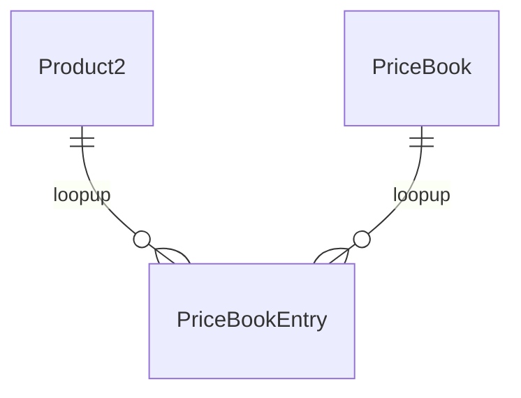
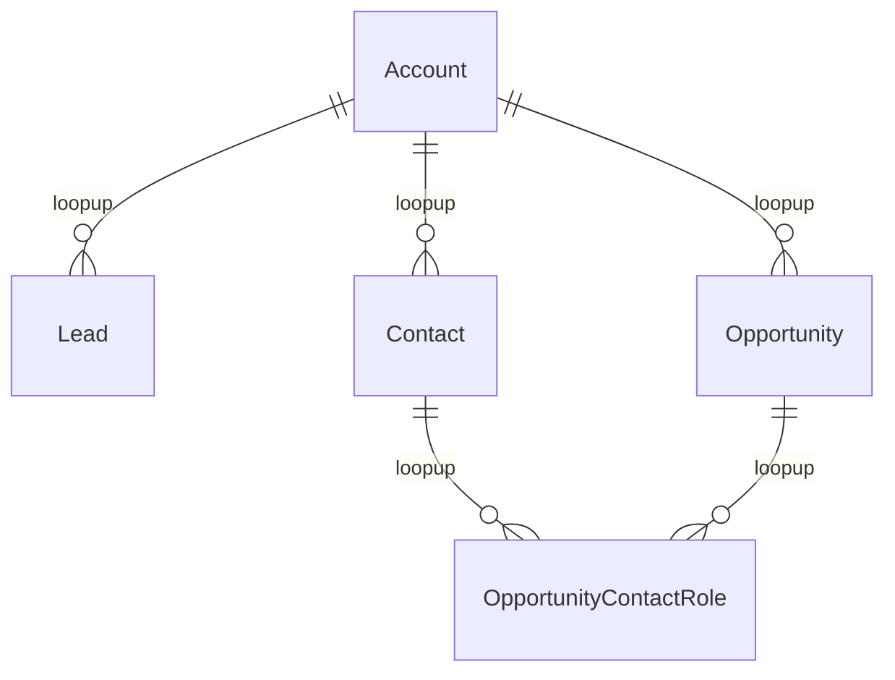
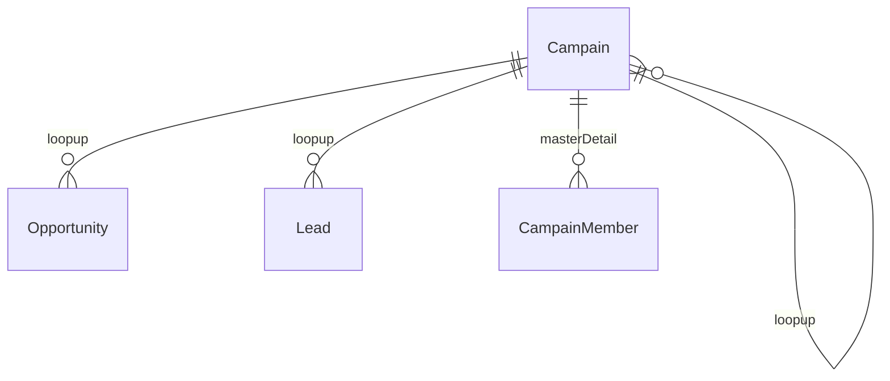
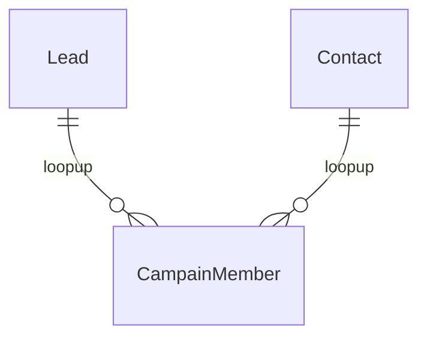

###  Sales App と Marketing App `14%`

##### 与えられたシナリオに従って、セールスプロセスの機能と影響を特定する

- Sales Process (定义Opportunity流程) 和以下一起使用
  - RecordType
  - Page Layout
  - Profile

##### 与えられたシナリオに従って、営業効率向上に役立つ適切な機能を特定する

- Account Teams （协作多个用户by defining a role for each team member）

- Opportunity Team（协作多个用户）

- Big Deal Alert （当**Trigger Amount** and **Trigger Probability** 达到指定值时，变会自动发邮件给指定人）

- Forecasts预算

  - Types （都可基于role，非重点）

    | OBJECT              | MEASURE                                                      | HIERARCHY           |
    | :------------------ | :----------------------------------------------------------- | :------------------ |
    | Opportunity         | Amount                                                       | TerritoryUser role  |
    | Opportunity Product | Total price                                                  | Territory*User role |
    | Opportunity Split   | Amount                                                       | User role           |
    | Line Item Schedule  | RevenueQuantityCustom currency (revenue) or number (quantity) | TerritoryUser role  |

  - 可更改预测范围 （月或季并可指定开始月及时间范围）
  
- Guide Users with Path

  - 创建路径来指导您的用户完成业务流程的各个步骤，例如从新的潜在客户到成功完成交易的业务机会。在路径的每一步，您都可以突出显示关键字段，并包含定制的成功指南。通过投掷虚拟五彩纸屑来帮助您的团队庆祝他们的成功。
  - Create Path需指定

    - Object
    - Record Type
    - Picklist
  
- ROI 投资回报率

  - 关键字：Contact Role

    -  Customize Opportunity Contact Role
    -  Add the Opportunity Contact Role related list to the Opportunity page layout
  
- Product Schedules Settings

  - 使用产品计划表确定付款或随时间交付的产品的付款和交付周期。为了灵活地管理和报告产品计划，可启用可自定义的计划。

    Schedule Types

    - quantity（数量，いつ商品が納入されるかが決まります。）
    - revenue（収益，いつ商品の支払いが行われるかが決まります）
    - default schedule（特定の価格表の特定の商品に関連付けられます。）
  
- 類似商談

  - Available in: Salesforce Classic
  - Available in: **All** Editions in orgs activated before Summer ’09
  - 仲間がうまく同じ競争相手と競争、同等の製品と他の商談を管理しているかを理解する

##### 商品と価格表はどのようなときに使用すべきか説明する

- 商品一定有standard价格

- 还可定义standard价格以外的价格

- 商品与价格手册多对多

- 一个商品的多种价格也可以是不同货币种类的

  

##### リードの自動化機能

- Convert所需要的Profile权限
  - `「リードの取引の開始」`プロファイル権限
  - `リード、取引先、取引先責任者、商談への「作成」「編集」`アクセス

- Convert

  ​	正常

  - Account

  - Contact

  - Opportunity

    启动個人取引先的情况下

  - 個人取引先

- 当Lead中自定义字段，Convert时也想对应的过去（Account，Contact，Opportunity）
  - Map Lead Fields（Lead => Fields & Relationships => Map Lead Fields）
  - Lead自定义字段 可Map到Account，Contact，Opportunity中的标准字段或自定义字段
  
- Lead Convert后

  - 转换一个链接到Campain的Lead时，该Campain自动插入Opportunity的Campain字段。
  - 如果Lead或Contact被链接到多个Campain，最近与其关联的Campain将被插入到Opportunity的Campain字段。

- Lead来源
  - Web-to-Lead
  - Input or Import (Data Import Wizard or Dataloader)
  
- Lead Assignment Rules
  - 把New Lead根据设置的分配规则分配个指定User或Quene
  - 可选Email Template
  
- Lead Auto-Response Rules
  - 当New Lead创建后，根据设置的规则，发送邮件给指的地址
  - 可选Email Template
  
- Lead Processes 

  - Business Processes中的一种
  - 与RecordType PageLayout配合使用

- Lead Settings
  - Default Lead Owner (当Assignment Rules过后仍没有被分配的Lead,会设置为此)

##### キャンペーンの管理方法を説明する

Campaign Record详细的按钮

- Manage Campain Members
  - upsert Campain Members
- Import Leads And Contacts
  - upsert Leads And Contacts

Campaign Influence

- 允许营销人员对影响单个机会的多个营销活动进行测量和报告。有影响力的活动可以手动或自动与Opportunity关联。

- 可让用户在业务机会上查看影响市场活动
  将多个有影响力的活动纳入到单一的业务机会。

##### Salesforce コンテンツの機能を説明する

- 组织、共享、搜索和管理内容。
  - 发布和同事共享企业官方文件并将这些文件提供给客户。
  - 创建、复制或修改销售演示并将其保存使得只有您才可以查看和处理它。当您准备就绪时，将其发布使贵公司的其他用户具有权限可访问它。创建内容包并将其发送给客户
- 强大的 Salesforce CRM Content 搜索引擎扫描文档全文和内容属性
  - 可以通过特征内容、文件格式、作者、标记、库或自定义字段筛选搜索
  - 也可以按 Chatter 文件筛选搜索结果
- Chatter file 和 Liberals的文件 存储在Salesforce CRM Content
- Content Tags are case insensitive. 不区分大小写
- Content delivery feature
  - 使您能够将文档（如 Microsoft® PowerPoint 和 Word 文件）转换为可轻松在线查看的经过优化的网页版本。
  - 过期日期
  - Public Links 无需密码即可访问
  - 可以选择需要密码访问内容
  - 使用查找以将您的内容递送与 Salesforce 记录相关联。默认选中您单击**递送内容**时正查看的记录

- Files、Salesforce CRM Content、Salesforce Knowledge、Documents和Attachments之间的[区别](https://help.salesforce.com/s/articleView?id=sf.collab_files_differences.htm&type=5)

