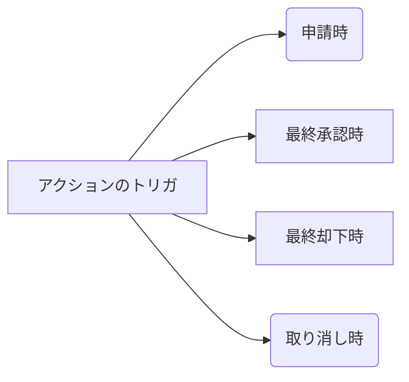

### Workflow/Processの自動化 `8%`

##### 与えられたシナリオに従って、ワークフロー/プロセスの機能を使用した適切な自動化ソリューションを特定する

- 触发条件
  - 作成された時
  - 作成された時、および編集されるたび
  - 作成された時、およびその基準を満たすように編集された時
- ルール条件
  - 条件が一致する
  - 数式の評価がTureになる時
- 满足条件是的动作
  - Todo （Task）
  - メールアラート（等级高或者金额高等大事，可发邮件通知）
  - 項目自動更新(更新自己)
  - アウトバウンドメッセージ（向外部系统API发消息）
- 案例：
  - 更新自己的RecordType字段，可以改变业务流程（Opportunity,Case, Lead）
- 時間ベースのワークフロー
  - 删除时间Action时，会删除已经准备启动的动作
  - キューの待機中に条件に適合しなくなった場合はアクションが削除される。
  - 不满足条件时，会删除已经准备启动的动作
  - タイムトリガ。ルールが適用されたタイミングから○日前、○日後、○時間前、○時間後の設定ができる。
  - 実行されるまでのアクションはキューに待機される、Setup→Monitoring→Time-Based Workflowで検索可能
  - ワークフロールールの基準が「レコードが作成または編集されたとき」に設定されている場合、時間ベースのワークフローアクションを使用できない

##### 承認プロセスの機能とユースケースを説明する

- 可更新本记录以及相关记录

- 可创建新纪录

- Submit for Approval

- Flows

  以上重点，以下详细参考：

  | **workflow**     | **Process builder**                                          |
  | ---------------- | ------------------------------------------------------------ |
  | Task             | Apex (The Apex class must have an invocable method.)    |
  | Email Alert      | Create a Record (any object)                                 |
  | Field Update     | Email Alerts                                                 |
  | Outbound Message | Flows                                                        |
  |                  | Post to Chatter                                              |
  |                  | Processes (Only active invocable processes can be started by a process.) |
  |                  | Quick Actions                                                |
  |                  | Quip                                                         |
  |                  | Send Custom Notification                                     |
  |                  | Submit for Approval                                          |
  |                  | Update Records  (Record that started your process or a record related to the sobject) |

##### Flow (今后SF的流程重心移向Flow)

- 做一下Trailhead[例子](https://trailhead.salesforce.com/en/content/learn/modules/business_process_automation/flow) 熟悉一下 
- 分类
  - 画面流程 （可防止Lightning Comconent）
  - Backend流程
- Debug:native feature
- ID of a Record
  -  $Record.Id
- Flow Error
  - Use a fault connector and display a screen with text explaining what went wrong and how to correct it.

##### 承認プロセス

- アクションのトリガは下記4種類

  - 申請時
  - 最終承認時
  - 最終却下時
  - 取り消し時

##### Actions

- Email Alert
- Field Update
- OutBound Message

##### approvers

- permissions
  - “Modify All Data”
  - “Modify All” for an object
- Make sure that the assigned approver has access to read the records for the approval requests. For example, a user who can’t view expense records can’t view expense approval requests.
- Approval processes that let users select an approver manually also let users select themselves as the approver
- 注意
  - 承認申請の履歴を確認するには承認履歴関連リストから確認する。
  - 条件を満たしたら承認申請を出すのであればプロセスビルダーを使用する。
